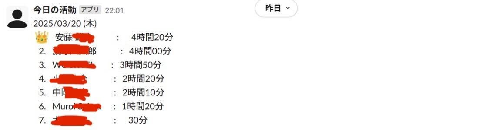

# Slack Activity Logger

Slack メンバーのアクティブ時間の集計 bot
ワークスペースのメンバーのアクティブ時間を自動で集計し、毎日 0 時に Slack チャンネルへデイリーレポートを送信します。

## 技術スタック

[](https://skillicons.dev)

- Backend : Java
- Framework : Spring Boot
- Build Tool : Gradle

## Feature



- 活動時間の可視化 : メンバーがどの程度 active かどうかわかります
- 定期実行 : cron などで定期実行させることで、毎日 0 時に集計レポートを送信します

## 環境構築

1. SDKMAN のインストール

   ```bash
   curl -s "https://get.sdkman.io" | bash
   source "~/.sdkman/bin/sdkman-init.sh"
   ```

2. Java のインストール

   ```bash
   sdk install java 21.0.2-open
   ```

3. Gradle のインストール

   ```bash
   sdk install gradle
   ```

## アプリケーションの設定

1. Slack API トークンの取得

   - [Slack API](https://api.slack.com/) にアクセスし、`Your apps` -> `Create New App` からアプリを作成
   - `OAuth & Permissions` から `Bot Token Scopes` に `users:read` と `chat:write` を追加
   - `Bot User OAuth Token` をコピーして取得

2. Slack チャンネルにアプリを追加 & チャンネル ID の取得

   - Slack チャンネルに作成したアプリを追加
   - チャンネルリンクからチャンネル ID をコピーして取得

3. apprication.properties の設定

   - ファイルの作成

     ```bash
     cp src/main/resources/application.properties.example src/main/resources/application.properties
     ```

   - Property の設定

     ```apprication.properties
     slack.api.token=xoxb-####-######
     slack.channel.id=C0123456789
     active.user.threshold.in.unix.time=1680307200   # active user の対象時刻
     ```

4. cron の定期実行の設定

   - shell script の作成

     ```run_app.sh
     #!/bin/bash
     export JAVA_HOME=$HOME/.sdkman/candidates/java/current
     cd /path/to/project/root || exit
     ~/.sdkman/candidates/gradle/current/bin/gradle bootrun > /path/to/logfile.log 2>&1
     ```

   - 実行権限の付与

     ```bash
     chmod +x run_app.sh
     ```

   - cron の設定

     ```bash
     #crontab の編集
     crontab -e
     ```

     ```crontab
     # 10分毎に実行
     */10 * * * * /path/to/run_app.sh
     ```

### アプリケーションの実行(手動)

```bash
gradle bootRun
```

## Note

- 本アプリケーションは Slack API を利用しています。Slack の API 利用規約に従ってご利用ください。

- active.user.threshold.in.unix.time を設定することで、その期間以降にプロフィールの更新があったユーザーが active user として track されます。デフォルトでは 2023 年 4 月 1 日に設定しています。

- 定期実行の間隔は適宜変更してください。また、あくまで online status をもとに集計しているため、実際の活動時間とは異なる場合があるので、参考程度に利用してください。
